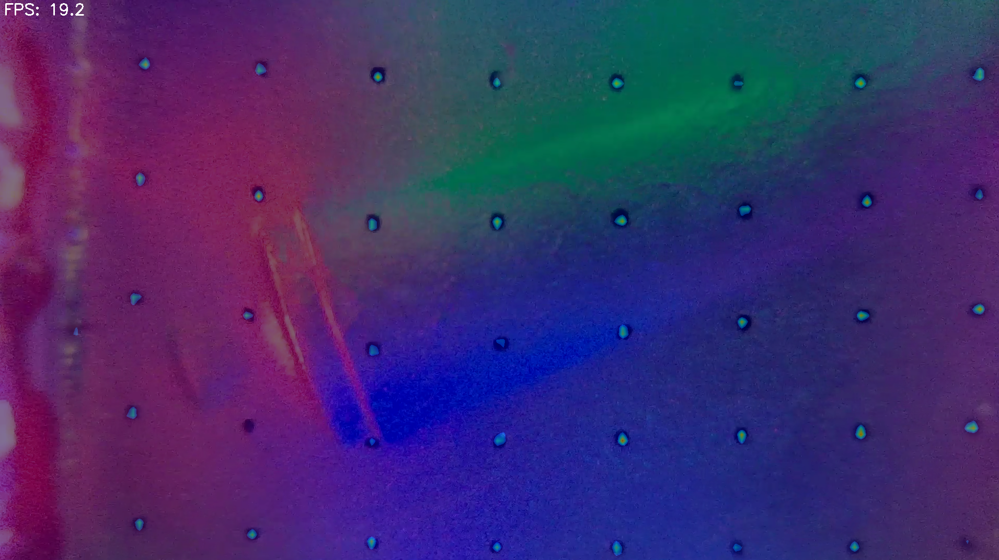
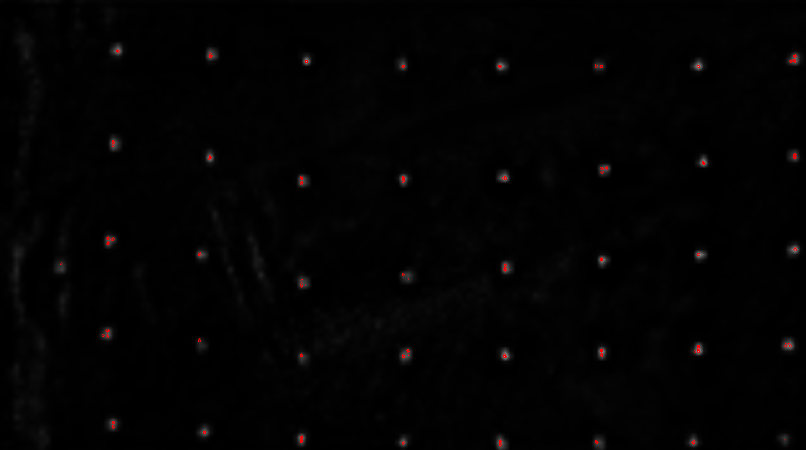

# CenterNet Heatmap Prediction for Marker Detection in Tactile Sensing

We are trying to predict a heatmap of pseudo probability distribution of markers, from the raw image of a tactile sensor, for example, the [D-Sight](https://github.com/0x15c/D-Sight). This repo is still under construction; however, we have obtained some promising results from [CenterNet](http://arxiv.org/abs/1904.07850).

We use ResNet-9 as the backbone for feature extraction; it's a lightweight alternative, producing only ~11.5 MB model. We believe inference can be accelerated using light models while feature extraction ability is preserved, due to our rather simple sensor output (we are not expecting the model to recognise complex features, such as an animal). Here is a [link](https://github.com/Moddy2024/ResNet-9.git) to the ResNet-9 implementation.

Below is an image of mixed raw sensor output and predicted marker distribution.

We use the orb feature extractor to get the keypoints.

Next step: we are trying to obtain the displacement vector field from the inferred marker distribution, which is the most challenging step.
