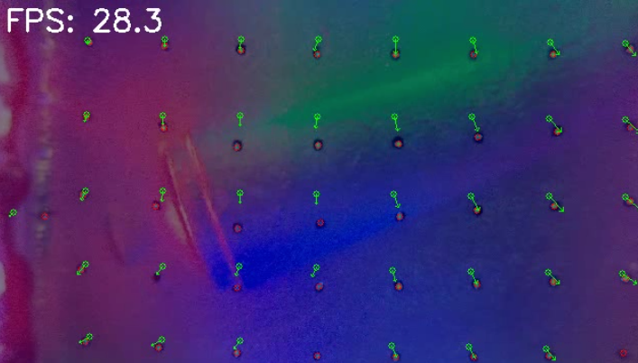

# CenterNet Heatmap Prediction for Marker Detection in Tactile Sensing

We are trying to predict a heatmap of pseudo-probability distribution of markers, from the raw image of a tactile sensor, for example, the [D-Sight](https://github.com/0x15c/D-Sight). This repo is still under construction; however, we have obtained some promising results from [CenterNet](http://arxiv.org/abs/1904.07850).

We use ResNet-9 as the backbone for feature extraction; it's a lightweight alternative, producing only ~11.5 MB model. We believe inference can be accelerated using light models while feature extraction ability is preserved, due to our rather simple sensor output (we are not expecting the model to recognise complex features, such as an animal). Here is a [link](https://github.com/Moddy2024/ResNet-9.git) to the ResNet-9 implementation.

Below is an image of mixed raw sensor output and predicted marker distribution. We tested our code using video data acquired from our [D-Sight](https://github.com/0x15c/D-Sight) sensor, an extra-low-cost alternative to GelSight dedicated to robotics applications.

CenterNet probability distribution over input image             |  Extracted keypoints
:-------------------------:|:-------------------------:
 |  

The [VoxelMorph](https://arxiv.org/abs/1809.05231) code is employed in our code to predict the *marker displacement field* (To see why this problem is important in tactile sensing, check [this review paper](https://doi.org/10.1109/JSEN.2023.3255861)). As a successful approach to generating a dense displacement field from a given n-D {fixed, moving} voxelmap pair, Voxelmorph converts the hard optimisation-based image registration problem into a function-based one, resulting in its high efficiency and accuracy when trained and evaluated on a given distribution of the dataset. The training of Voxelmorph does not need a ground truth displacement field, as it is difficult to obtain; however, the supervision signal is directly generated by the loss function, which punishes the unsimilarity of the image pair and the smoothness of the displacement field, in its derivative norms.

We rewrite the logic of Voxelmorph to make it focused on 2D image registration. The pointwise displacement vector is calculated from the mean flow field within an area centred on that pixel. Below is an image of the vector arrows. The green dots are those estimated marker centroids in their initial position, and the red ones show the moved centroids. The arrows illustrate the direction and magnitude of the displacement field. Our code can run ~28 FPS on a workstation PC (AMD R9-9900X, RTX 5070Ti GPU), with video resolution of 640x360. The performance bottleneck is at the centernet prediction stage.

